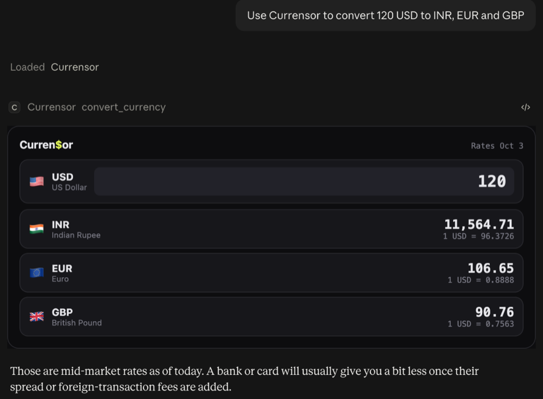

# Curren$or 💱

A sleek currency converter you can self-host in seconds. Compare up to 5 currencies at once with live exchange rates, swap them around, search through 50 options. One HTML file, zero setup.


**[→ Try it live](https://kay0sstheory.github.io/Currensor/)** · **[→ Use it inside Claude or ChatGPT](#use-it-inside-claude-or-chatgpt)**

---

## Use it inside Claude or ChatGPT

Currensor also runs as a plugin (an MCP server) for Claude and ChatGPT. Ask for a conversion in plain words and a live Currensor card appears right in the chat. Change the amount on the card and every currency updates instantly.



**Plugin address:**

```
https://currensor-mcp.currensor-mcp.workers.dev/mcp
```

| App | How to add it |
|---|---|
| **Claude** | Settings → Connectors → Add custom connector → paste the address → choose *No sign-in* |
| **ChatGPT** | Settings → Plugins → Developer mode on, then **+** → Create custom MCP server → paste the address → *No Auth* |

Then ask: *"Use Currensor to convert 250 CAD to INR, EUR and JPY."*

- Live mid-market rates for 166 currencies, refreshed hourly, with a backup rate feed
- No sign-in, no API key, nothing about you stored. The server keeps only anonymous daily counts (which app, which currency pair) to see if people find it useful
- Free and open source: the server is in [`mcp/`](mcp/) and runs on Cloudflare Workers

---

## Features

- **Live exchange rates** — Fetched from open APIs with auto-refresh every 5 minutes
- **50 currencies** — Grouped by region (Americas, Europe, Asia & Pacific, Middle East & Africa)
- **Multi-currency view** — See up to 5 conversions side by side
- **Smart swap logic** — Picking a currency already in use auto-swaps instead of duplicating
- **Drag to reorder** — Rearrange your target currencies by dragging the grip handle
- **Dark & Light themes** — Trading terminal dark mode or clean travel app light mode, saved to your preference
- **Shareable conversion cards** — Generate a branded PNG image of your conversion to share anywhere
- **Export / Copy** — One tap copies all conversions with currency symbols, ready to paste into WhatsApp, Slack, or email
- **Bottom-sheet picker** — Mobile-friendly currency selector with instant search
- **Cross-platform flags** — Twemoji flag images that render identically on every device
- **Graceful fallback** — Bundled rates kick in if APIs are unavailable
- **Zero dependencies** — One HTML file. No frameworks, no build step, no node_modules

## How to Use

**Option 1: Just open it**
```bash
git clone https://github.com/Kay0sstheory/Currensor.git
cd Currensor
# Open index.html in your browser
```

**Option 2: GitHub Pages** *(free hosting)*
Already live at **[kay0sstheory.github.io/Currensor](https://kay0sstheory.github.io/Currensor/)**

## Supported Currencies

**Americas:** USD, CAD, MXN, BRL, ARS, CLP, COP, PEN
**Europe:** EUR, GBP, CHF, SEK, NOK, DKK, PLN, CZK, HUF, RON, TRY, RUB, UAH, ISK
**Asia & Pacific:** JPY, CNY, INR, KRW, SGD, HKD, TWD, THB, MYR, IDR, PHP, VND, PKR, BDT, LKR, AUD, NZD
**Middle East & Africa:** AED, SAR, QAR, KWD, BHD, ILS, EGP, ZAR, NGN, KES, MAD

## Tech Stack

- Pure HTML, CSS, JavaScript — no frameworks, no libraries
- [Open Exchange Rates API](https://open.er-api.com/) (primary) + [Currency API](https://github.com/fawazahmed0/exchange-api) (backup)
- Twemoji CDN for cross-platform flag rendering
- DM Sans + Space Mono fonts via Google Fonts
- Canvas API for shareable card generation
- Dark/light themes via CSS variables with localStorage persistence
- Mobile-responsive down to 360px viewport

## Version History

- **v2.2** — Claude & ChatGPT plugin with an in-chat card; refreshed backup rates
- **v2.1** — Swap logic fix, drag-to-reorder, cross-platform Twemoji flags, bigger rate text, dark/light theme toggle, shareable conversion cards, export/copy with currency symbols
- **v2.0** — Live exchange rates, 50 currencies grouped by region, live status indicator, improved mobile UX
- **v1.0** — Initial release with bundled rates and 20 currencies

## Roadmap

- [ ] Interactive globe for selecting target currencies (v3)
- [ ] Historical rate sparkline charts
- [ ] Rate heatmap — weekly performance at a glance
- [ ] Volatility indicator per currency pair
- [ ] Purchasing power comparison
- [ ] Shareable URLs with encoded conversion state
- [ ] Favorites saved to localStorage

## Why I Built This

I'm building tools with AI and learning in public. I can't write code from scratch (yet), but I can design, think through problems, and ship real products by collaborating with AI. Every project teaches me something new.

Follow along: [@Kay0sstheory](https://github.com/Kay0sstheory)

## License

MIT — do whatever you want with it.
